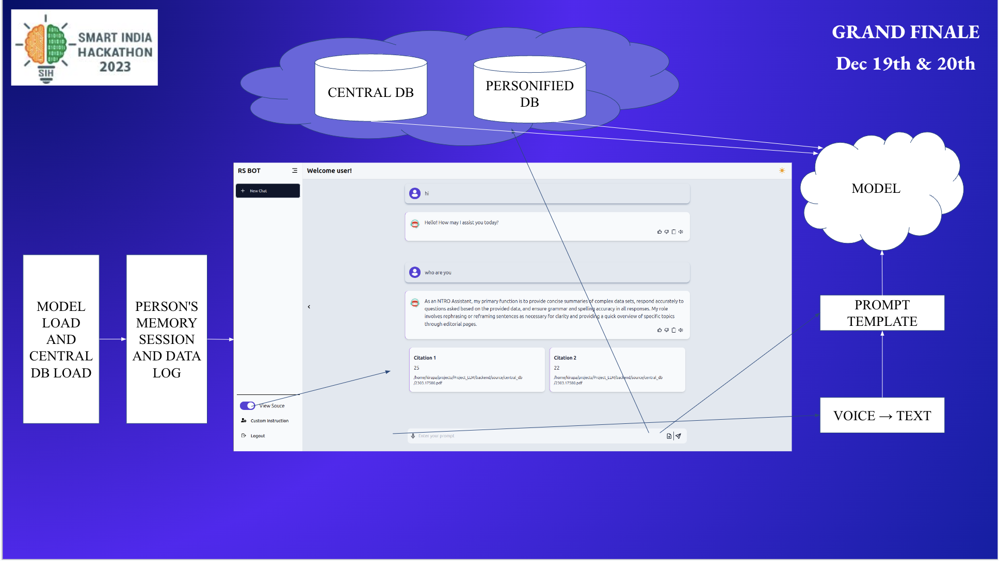

# RS BOT

An offline based LLM tool for generating responses for network not connected over the internet.



Run the Project

Clone the project

```bash
git clone https://github.com/neokd/Project_LLM.git
```

Go to the project directory

```bash
cd Project_LLM
```

### Server

```bash
cd backend
```

Install dependencies

```bash
pip install -r requirements.txt
```

Start the server

```bash
uvicorn app:app --reload
```

### Client

```bash
cd frontend
```

Install dependencies

```bash
npm install
```

Start the client

```bash
npm run dev
```

## Authors
- [Kuldeep L](https://www.github.com/neokd)
- [Priyadharshini P](https://www.github.com/priyamakeshwari)
- [Karthikeyan K](https://www.github.com/karthi-cmd)
- [Priyadharshini M](https://github.com/Priyakumar23)
- [Gladwin I](https://www.github.com/Gladwin001)
- [Kirupalakshmi G](https://www.github.com/kirupa22)